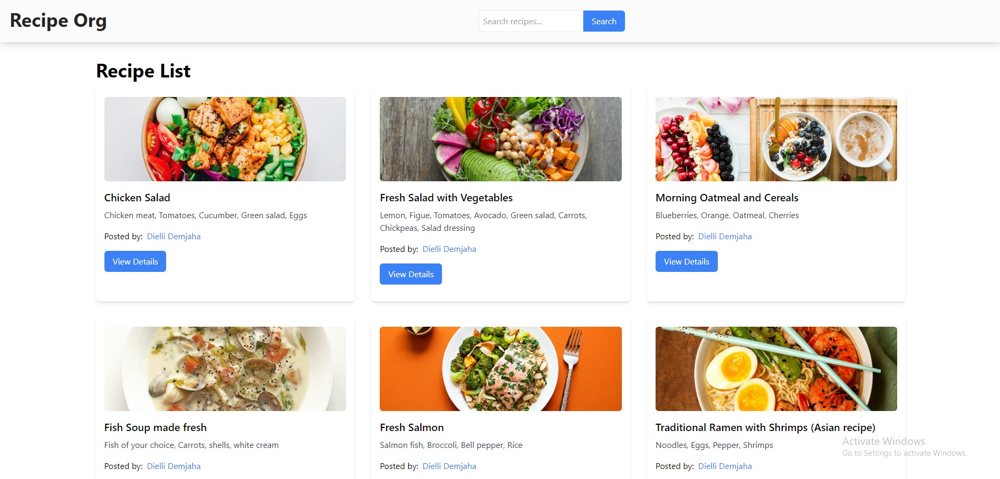
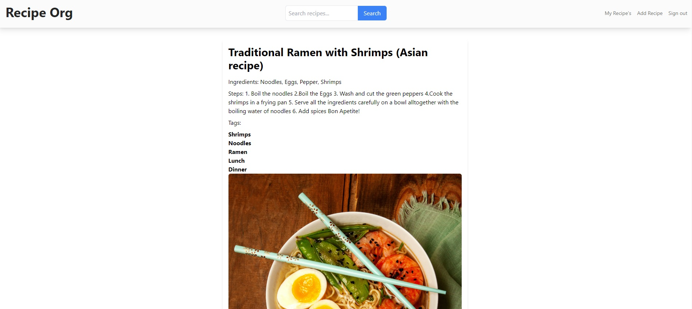
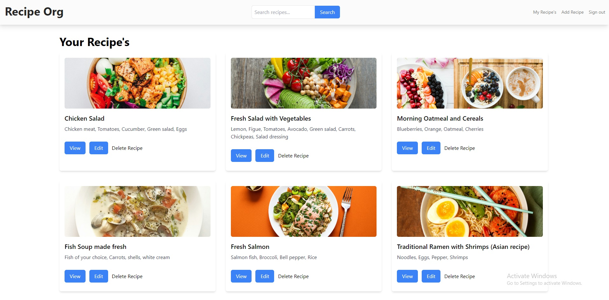
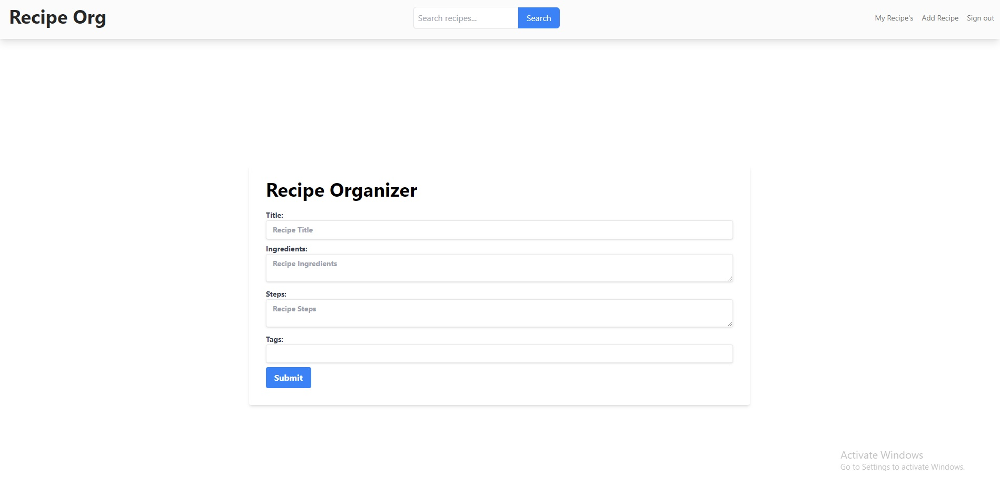

# Recipe Sharing App









Welcome to the Recipe Sharing App! This web application allows authenticated users to share their favorite recipes with the community. It is built using Laravel, React, MySQL, GraphQL API, and Tailwind CSS.

## Features

- **User Authentication**: Users can sign up, log in, and securely authenticate to access the recipe-sharing platform.

- **Recipe Management**: Authenticated users can create, edit, and delete their own recipes. Each recipe includes details such as ingredients, instructions, and images.

- **GraphQL API**: The application leverages GraphQL for efficient and flexible data retrieval, providing a seamless experience for clients.

- **Responsive Design**: The user interface is designed to be responsive and accessible, ensuring a consistent experience across various devices.

## Technologies Used

- **Laravel**: A powerful PHP web application framework used for backend development.

- **React**: A JavaScript library for building user interfaces, utilized for the frontend of the application.

- **MySQL**: A relational database management system employed to store and manage recipe data.

- **GraphQL**: A query language for APIs that enhances data fetching and manipulation.

- **Tailwind CSS**: A utility-first CSS framework for designing modern and clean user interfaces.

## Getting Started

1. **Clone the Repository**:
   ```bash
   git clone https://github.com/your-username/recipe-sharing-app.git

2. **Install Dependencies**:
  ```bash
# Install backend dependencies
cd recipe-sharing-app/backend
composer install

# Install frontend dependencies
cd ../frontend
npm install

# **Set Up Database**:
cd backend
php artisan migrate

# **Start the Application**:
// Start Laravel backend
cd backend
php artisan serve

// Start React frontend
cd frontend
npm start
```

**Access the Application**:
Open your browser and navigate to http://localhost:3000 to access the Recipe Sharing App.
